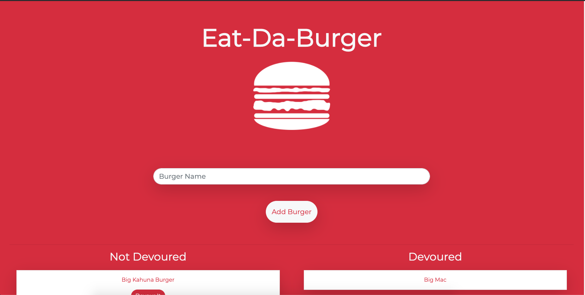
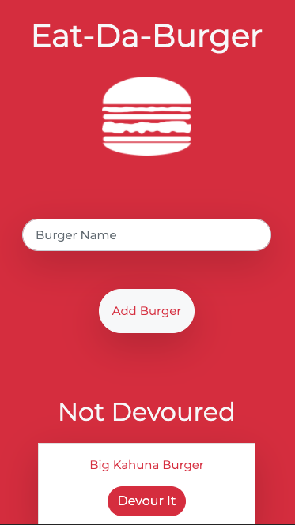

# Eat-Da-Burger

Eat-Da-Burger is a web application that allows the user to input burger names, and devour them later on. 

Each burger name is stored in a database and has a name and devoured property. If the burger is devoured, it will appear on the right side of the screen on a desktop version, and on the bottom of the screen on a mobile version. Burgers that are not devoured will apper on the left for a desktop, and on the upper half of the screen on a mobile version. 

The application was built using MySQL, Handlebars, and Express.

## Usage

Eat-Da-Burger is deployed using Heroku. It can be viewed [here](https://mysterious-everglades-88130.herokuapp.com/).

## Testing

When testing on your local host, download the repository.

Run the following in your terminal to get all dependencies:
```bash
npm i
```

Run the following in your terminal to launch the server:
```
node server.js
```

In your browser, type the following to see the application:
> localhost:3000/

To see the contents of the database as you perform various requests, you can use a third-party application like [Postman](https://www.postman.com/downloads/)

In Postman, for a GET request to see all burgers in the database:
> localhost:3000/api/burgers

For a POST request to insert a new burger:
> localhost:3000/api/burgers

With a request body that has an object such as:
```JavaScript
{ burger_name: 'name', devoured: false }
```

For a PUT request to update a burger's `devoured` property:
> localhost:3000/api/burgers/:id

Where `:id` is the unique id given to a burger upon creation. 

## Images

* The landing page of Eat-Da-Burger, with a form input and submit button.



* The 'Not Devoured' and 'Devoured' columns, showing all burgers in the database.


* Clicking  the 'Devour It' button for the burger 'Double Double Cheeseburger' moves it into the 'Devoured' column.
  


* A mobile-responsive view of Eat-Da-Burger


